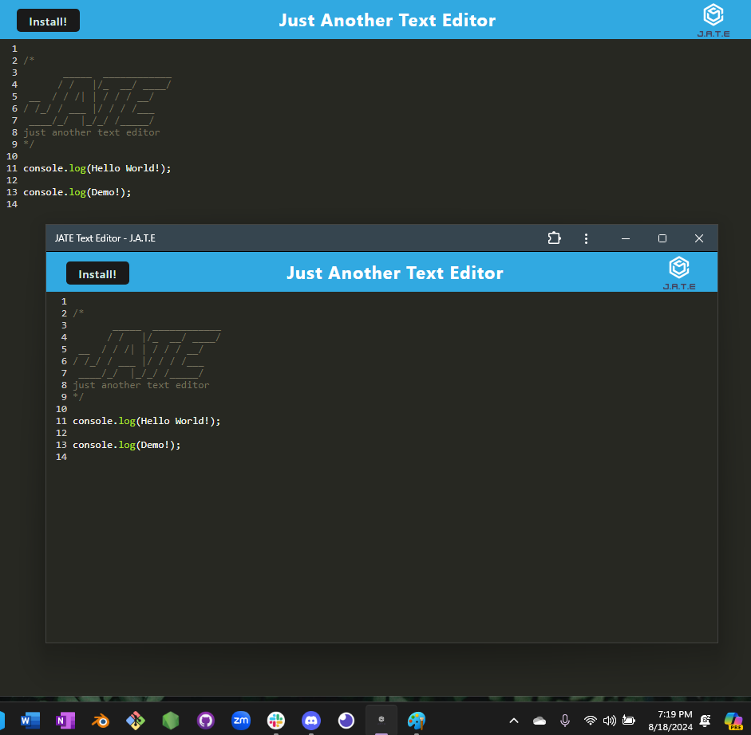
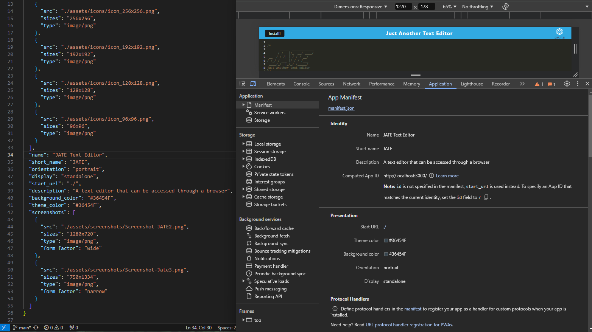

# PWA-ScribePro

PWA-ScribePro is a versatile text editor designed for creating notes or code snippets, both online and offline. This Progressive Web Application leverages cutting-edge web technologies to ensure your content is always accessible, even when you're not connected to the internet.

PWA-ScribePro allows you to concentrate on your content without the concern of connectivity. It features support for next-gen JavaScript and a dependable storage system powered by IndexedDB, your notes are securely stored and readily accessible whenever you need them.

- This app allows you to experience the freedom to work online or offline with ease. Your content is automatically saved and retrieved using IndexedDB, ensuring it's always available whenever you need it.

- Easily bundle your JavaScript files with Webpack, packaging everything you need into a seamless, ready-to-go setup.

- Leverage the power of modern web technologies with built-in service workers, manifest files, and offline capabilities. Everything you need for a seamless experience is included.

- Install the app as a desktop icon, and your text editor will be just a click away, ready whenever you need it.

## Installation

To install PWA-ScribePro:

- Clone the repository: https://github.com/AcoderRose/PWA-ScribePro

- Go to the project directory

- Launch the terminal and install the dependencies by executing the following command: `npm install`

## Usage

Start the application, in the terminal by executing the following command: `npm run start`

Open the text editor from your terminal. Your JavaScript files will be bundled using Webpack, ensuring smooth operation.

You will be redirected to the application at: `http://localhost:3000/`

If you click the "install" button on the web browser app, you will get an offline desktop application version with its own taskbar icon.

[Link to Deployed PWA-ScribePro Application]()

## Credits

[Kaila Ronquillo](https://github.com/girlnotfound)

[Ryan Petersen](https://github.com/RyanPetersen-89)
